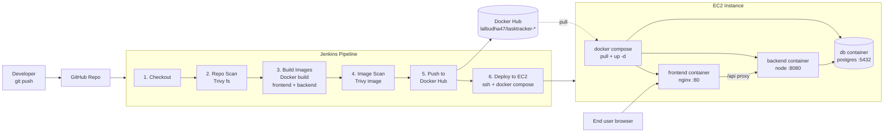

# Industry-Standard CI/CD with Jenkins — 3-Hour Workshop

**Audience:** students with basic Docker/Docker Compose knowledge.
**Project:** one complete pipeline, one complete 3-tier app — no toy examples.
**Goal:** by the end, every student has pushed a commit that Jenkins scanned,
built, scanned again, pushed to Docker Hub, and deployed to a live EC2 box.

## Pipeline flow



## Prerequisites (send to students before the session)

- Docker + Docker Compose installed locally, and they can run
  `docker compose up --build` in any project.
- A GitHub account and a fork/clone of this repo.
- A free Docker Hub account (for their own image namespace — do **not**
  use the instructor's credentials for anything except the live demo).

## Instructor-only setup (do before the workshop, not live)

1. Jenkins running (container or VM) with plugins: **Docker Pipeline**,
   **SSH Agent**, **Credentials Binding**.
2. Trivy installed on the Jenkins agent:
   ```bash
   sudo apt-get install -y wget apt-transport-https gnupg lsb-release
   wget -qO - https://aquasecurity.github.io/trivy-repo/deb/public.key | sudo apt-key add -
   echo "deb https://aquasecurity.github.io/trivy-repo/deb $(lsb_release -sc) main" | sudo tee -a /etc/apt/sources.list.d/trivy.list
   sudo apt-get update && sudo apt-get install -y trivy
   ```
3. An EC2 instance (Ubuntu, t2.micro is fine) with Docker + the Compose
   plugin installed, and this repo cloned once to `~/tasktracker-cicd-lab`:
   ```bash
   git clone <your-repo-url> ~/tasktracker-cicd-lab
   ```
   Security group: allow inbound 80 (app) and 22 (Jenkins SSH deploy) from
   the Jenkins server's IP.
4. **Add credentials in Jenkins — never in a file, never in the repo:**
   - Manage Jenkins → Credentials → System → Global credentials → Add Credentials
     - Kind: *Username with password*, ID: `dockerhub-creds`
       Username: your Docker Hub username, Password: a Docker Hub **access
       token** (Docker Hub → Account Settings → Security → New Access Token),
       not your account password.
     - Kind: *SSH Username with private key*, ID: `ec2-ssh-key`
       Username: `ubuntu`, Private key: paste the EC2 `.pem` contents.

   > This is the point of the whole exercise: secrets live in Jenkins'
   > credential store and are referenced by ID (`credentials('dockerhub-creds')`,
   > `sshagent(['ec2-ssh-key'])`) — they never appear in the Jenkinsfile or
   > git history. If a token is ever pasted somewhere it shouldn't be
   > (chat, a file, a screen share), treat it as burned and regenerate it
   > from Docker Hub afterward — rotating a token costs nothing; a leaked
   > one is a standing risk.

## Lab timeline (3 hours)

| # | Lab | Time | Outcome |
|---|-----|------|---------|
| 1 | Explore the app + run it locally | 30 min | App runs via `docker compose up --build`; students understand the 3 tiers and the diagram above |
| 2 | Install Jenkins job + wire credentials | 40 min | A Jenkins Pipeline job exists, points at the repo, and both credentials are configured |
| 3 | Build, scan, push pipeline | 50 min | Pipeline runs stages 1–5: checkout, Trivy repo scan, build, Trivy image scan, push to Docker Hub |
| 4 | Deploy to EC2 + verify | 40 min | Pipeline stage 6 deploys; students hit the EC2 public IP and see their build live |
| — | Wrap-up / Q&A / break buffer | 20 min | — |

### Lab 1 — Explore the app (30 min)

- Walk the diagram above out loud: browser → nginx → Express → Postgres.
- `cp .env.example .env && docker compose up --build`
- Open http://localhost:8081, add/toggle/delete a task.
- Show `frontend/nginx.conf` — this is the one non-obvious piece: nginx
  proxies `/api/*` to the backend container by service name, so the
  frontend JS never hardcodes a backend host.

### Lab 2 — Jenkins job + credentials (40 min)

- Create a new Pipeline job, "Pipeline script from SCM", point it at the
  repo, script path `Jenkinsfile`.
- Add the two credentials as described above.
- Run the job with `EC2_HOST` left blank — it should complete through the
  push stage and skip deploy (the `when` condition on that stage).

### Lab 3 — Read the pipeline stage by stage (50 min)

Walk the Jenkinsfile top to bottom, matching each stage to the diagram:

- **Repo Scan (Trivy `fs`)** — scans source and dependency manifests
  *before* anything is built. Open the archived `trivy-repo-report.txt`
  from the build artifacts.
- **Build Images** — parallel `docker build` for frontend and backend,
  tagged `${DOCKERHUB_NAMESPACE}/tasktracker-<tier>:${IMAGE_TAG}`.
- **Image Scan (Trivy `image`)** — scans the *built* image, catching OS
  package vulnerabilities the repo scan can't see. Note both reports are
  archived as Jenkins build artifacts either way (`exit-code 0` — see
  "Going further" below for making this a hard gate).
- **Push to Docker Hub** — `docker login` using the injected
  `DOCKERHUB_CREDENTIALS_USR` / `_PSW` env vars from the credential,
  never a literal string.

### Lab 4 — Deploy to EC2 (40 min)

- Re-run the job with `EC2_HOST=ubuntu@<instance-ip>`.
- Watch the **Deploy to EC2** stage: `sshagent` injects the private key
  for just that shell step, then it's `git pull` + `docker compose pull` +
  `up -d` on the box.
- Open `http://<instance-ip>` in a browser — that's their build, live.
- Have each student point their own fork at their own Docker Hub
  namespace and EC2 box (or a shared sandbox instance) to run this
  end-to-end themselves if time allows.

## Going further (optional, if the group is ahead of schedule)

- Change `--exit-code 0` to `--exit-code 1` on the image scan stage so a
  HIGH/CRITICAL finding actually **fails the build** — this is the
  industry-standard "quality gate" pattern.
- Add a `Webhook` trigger (GitHub → Jenkins) instead of manual builds.
- Swap the manual `IMAGE_TAG` parameter for `${env.GIT_COMMIT[0..7]}` so
  every image is traceable to a commit.

## Troubleshooting

- **`trivy: command not found`** — Trivy isn't installed on the Jenkins
  agent (see instructor setup step 2).
- **`docker: permission denied`** — the Jenkins user isn't in the `docker`
  group on the agent: `sudo usermod -aG docker jenkins && sudo systemctl restart jenkins`.
- **Deploy stage hangs on host key prompt** — the `-o StrictHostKeyChecking=no`
  flag in the Jenkinsfile handles this; if it still hangs, the security
  group likely isn't allowing port 22 from the Jenkins server's IP.
- **Backend can't reach Postgres** — `db.js` retries for ~30s on boot; if
  it still fails, check `docker compose logs db` for a crashed container
  (usually a `.env` value mismatch).
