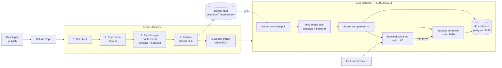

# Industry-Standard CI/CD with Jenkins — 3-Hour Workshop

**Audience:** students with basic Docker/Docker Compose knowledge.
**Project:** one complete pipeline, one complete 3-tier app — no toy examples.
**Goal:** by the end, every student has pushed a commit that Jenkins scanned
(source), built, and pushed to Docker Hub, then watched EC2 pull those
images, scan them (image), and bring the app up live.

## Pipeline flow



Note the image scan happens **on EC2, after pull, before the containers
start** — not on the Jenkins agent. Jenkins only scans source (`trivy fs`)
before build; the built images are pushed to Docker Hub unscanned and are
gated at the deploy target instead. This is a valid variant of the
standard pattern (some teams also scan pre-push — see "Going further"),
but for this workshop it also happens to be the pragmatic fix: it keeps
Jenkins from needing a second Trivy invocation per build and puts the gate
right before the images actually run.

## Prerequisites (send to students before the session)

- Docker + Docker Compose installed locally, and they can run
  `docker compose up --build` in any project.
- A GitHub account and a fork/clone of this repo.
- A free Docker Hub account (for their own image namespace — do **not**
  use the instructor's credentials for anything except the live demo).

## Instructor-only setup (do before the workshop, not live)

1. Jenkins running (container or VM) with plugins: **Docker Pipeline**,
   **SSH Agent**, **Credentials Binding**.

2. **The Jenkins user must be able to run `docker` commands.** This is the
   single most common blocker (`permission denied while trying to connect
   to the docker API at unix:///var/run/docker.sock`) — fix it now, before
   the first live run:

   - If Jenkins runs natively on the host (not in a container):
     ```bash
     sudo usermod -aG docker jenkins
     sudo systemctl restart jenkins
     ```
   - If Jenkins runs *inside a container* (common for quick setups) with
     `/var/run/docker.sock` bind-mounted in: the container's `jenkins`
     user needs the **host's** docker group GID, not just a same-named
     group inside the container. Either:
     ```bash
     # find the host's docker GID
     stat -c '%g' /var/run/docker.sock
     # recreate the container with that GID added
     docker run --group-add <that-gid> -v /var/run/docker.sock:/var/run/docker.sock ... jenkins/jenkins:lts
     ```
     or simplest for a workshop sandbox: run the Jenkins container itself
     with `-u root` (fine for a throwaway lab instance, not for a real
     shared Jenkins).
   - Verify before moving on: on the Jenkins host/container,
     `su - jenkins -c 'docker ps'` should list containers, not error.

3. Trivy installed on **both** the Jenkins agent and the EC2 host (the
   image scan now runs on EC2, not on Jenkins — see the diagram above):
   ```bash
   sudo apt-get install -y wget apt-transport-https gnupg lsb-release
   wget -qO - https://aquasecurity.github.io/trivy-repo/deb/public.key | sudo apt-key add -
   echo "deb https://aquasecurity.github.io/trivy-repo/deb $(lsb_release -sc) main" | sudo tee -a /etc/apt/sources.list.d/trivy.list
   sudo apt-get update && sudo apt-get install -y trivy
   ```

4. The EC2 instance (elastic IP `3.209.156.211` for this workshop) needs
   Docker + the Compose plugin + Trivy (step 3) installed, and this repo
   cloned once to `~/tasktracker-cicd-lab`:
   ```bash
   git clone <your-repo-url> ~/tasktracker-cicd-lab
   ```
   Security group: allow inbound 80 (app) and 22 (Jenkins SSH deploy) from
   the Jenkins server's IP. The Jenkinsfile's `EC2_HOST` parameter already
   defaults to `ubuntu@3.209.156.211` — change the SSH user in the
   Jenkinsfile parameter if this instance isn't Ubuntu-based (Amazon Linux
   uses `ec2-user`).

5. **Add credentials in Jenkins — never in a file, never in the repo:**
   - Manage Jenkins → Credentials → System → Global credentials → Add Credentials
     - Kind: *Username with password*, ID: `dockerhub-creds`
       Username: your Docker Hub username, Password: a Docker Hub **access
       token** (Docker Hub → Account Settings → Security → New Access Token),
       not your account password.
     - Kind: *SSH Username with private key*, ID: `ec2-ssh-key`
       Username: `ubuntu`, Private key: paste the EC2 `.pem` contents.

   > This is the point of the whole exercise: secrets live in Jenkins'
   > credential store and are referenced by ID (`credentials('dockerhub-creds')`,
   > `sshagent(['ec2-ssh-key'])`) — they never appear in the Jenkinsfile or
   > git history. If a token is ever pasted somewhere it shouldn't be
   > (chat, a file, a screen share), treat it as burned and regenerate it
   > from Docker Hub afterward — rotating a token costs nothing; a leaked
   > one is a standing risk.

## Lab timeline (3 hours)

| # | Lab | Time | Outcome |
|---|-----|------|---------|
| 1 | Explore the app + run it locally | 30 min | App runs via `docker compose up --build`; students understand the 3 tiers and the diagram above |
| 2 | Install Jenkins job + wire credentials | 40 min | A Jenkins Pipeline job exists, points at the repo, and both credentials are configured |
| 3 | Build, scan, push pipeline | 50 min | Pipeline runs stages 1–4: checkout, Trivy repo scan, build, push to Docker Hub |
| 4 | Deploy to EC2 + verify | 40 min | Pipeline stage 5 deploys; EC2 pulls, Trivy-scans the images, then starts them; students hit the EC2 public IP and see their build live |
| — | Wrap-up / Q&A / break buffer | 20 min | — |

### Lab 1 — Explore the app (30 min)

- Walk the diagram above out loud: browser → nginx → Express → Postgres.
- `cp .env.example .env && docker compose up --build`
- Open http://localhost:8081, add/toggle/delete a task.
- Show `frontend/nginx.conf` — this is the one non-obvious piece: nginx
  proxies `/api/*` to the backend container by service name, so the
  frontend JS never hardcodes a backend host.

### Lab 2 — Jenkins job + credentials (40 min)

- Create a new Pipeline job, "Pipeline script from SCM", point it at the
  repo, script path `Jenkinsfile`.
- Add the two credentials as described above.
- Run the job once manually ("Build Now") to confirm it's wired up
  correctly before relying on the trigger.

**From this point on, the workflow is: edit code → `git push` → walk away.**
The Jenkinsfile has `triggers { pollSCM('H/2 * * * *') }`, so Jenkins
checks GitHub for new commits every ~2 minutes and starts a build itself —
no one needs to click "Build Now" again. That single build then runs the
whole chain end to end: checkout, repo scan, build both images, push to
Docker Hub, SSH to EC2, pull, scan, deploy. This is the moment to make
explicit to students: **that's the entire point of CI/CD** — a push is the
only human action, everything after it is server-driven and reproducible.

> Polling is the simplest trigger and needs zero network configuration,
> which is why it's the default here — it works identically whether
> Jenkins is on a laptop, a VM, or behind NAT. The instant-trigger version
> used in real production setups is a **GitHub webhook**: GitHub repo →
> Settings → Webhooks → Add webhook → payload URL
> `http://<jenkins-public-url>/github-webhook/`, plus `githubPush()`
> instead of `pollSCM(...)` in the Jenkinsfile. It only works if Jenkins
> has a URL GitHub can reach, so it's a good "going further" upgrade
> rather than the workshop default.

### Lab 3 — Read the pipeline stage by stage (50 min)

Walk the Jenkinsfile top to bottom, matching each stage to the diagram:

- **Repo Scan (Trivy `fs`)** — scans source and dependency manifests
  *before* anything is built. Open the archived `trivy-repo-report.txt`
  from the build artifacts.
- **Build Images** — parallel `docker build` for frontend and backend,
  tagged `${DOCKERHUB_NAMESPACE}/tasktracker-<tier>:${IMAGE_TAG}`.
- **Push to Docker Hub** — `docker login` using the injected
  `DOCKERHUB_CREDENTIALS_USR` / `_PSW` env vars from the credential,
  never a literal string. Images are pushed unscanned at this point — the
  scan happens next, on EC2, right before they're started.

### Lab 4 — Deploy to EC2 (40 min)

- Re-run the job (EC2_HOST already defaults to `ubuntu@3.209.156.211`).
- Watch the **Deploy to EC2** stage: `sshagent` injects the private key
  for just that shell step, then on the box it's `git pull` →
  `docker compose pull` → **`trivy image` scan on both pulled images** →
  `up -d` → `docker image prune`. If either scan step exits non-zero the
  `&&` chain stops and `up -d` never runs — walk students through what
  that looks like by seeding a deliberately old base image tag.
- Open `http://3.209.156.211` in a browser — that's their build, live.
- Have each student point their own fork at their own Docker Hub
  namespace and EC2 box (or a shared sandbox instance) to run this
  end-to-end themselves if time allows.

## Going further (optional, if the group is ahead of schedule)

- Change `--exit-code 0` to `--exit-code 1` on the EC2-side image scan so
  a HIGH/CRITICAL finding actually **blocks the deploy** — right now it
  scans and reports but always continues to `up -d`. Flipping this on is
  the industry-standard "quality gate" pattern and a natural live demo:
  seed a known-vulnerable base image and watch the chain stop before
  `up -d`.
- Also scan images on the Jenkins side *before* push, in addition to the
  EC2-side scan, for defense in depth (belt-and-suspenders — catches
  problems earlier, at the cost of scanning every build twice).
- Add a `Webhook` trigger (GitHub → Jenkins) instead of manual builds.
- Swap the manual `IMAGE_TAG` parameter for `${env.GIT_COMMIT[0..7]}` so
  every image is traceable to a commit.

## Troubleshooting

- **`trivy: command not found`** — Trivy isn't installed on the Jenkins
  agent (repo scan stage) or the EC2 host (deploy stage) — see instructor
  setup steps 2 and 4.
- **`permission denied while trying to connect to the docker API at
  unix:///var/run/docker.sock`** — the Jenkins user can't talk to Docker
  on the agent. See instructor setup step 2 above for the native vs.
  containerized-Jenkins fix. This blocks the `Build Images` stage
  specifically (both parallel branches fail with this same error).
- **Deploy stage hangs on host key prompt** — the `-o StrictHostKeyChecking=no`
  flag in the Jenkinsfile handles this; if it still hangs, the security
  group likely isn't allowing port 22 from the Jenkins server's IP.
- **Backend can't reach Postgres** — `db.js` retries for ~30s on boot; if
  it still fails, check `docker compose logs db` for a crashed container
  (usually a `.env` value mismatch).
