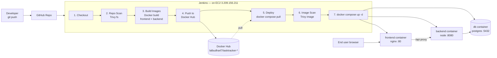

# Industry-Standard CI/CD with Jenkins — 3-Hour Workshop

**Audience:** students with basic Docker/Docker Compose knowledge.
**Project:** one complete pipeline, one complete 3-tier app — no toy examples.
**Goal:** by the end, every student has pushed a commit that Jenkins scanned
(source), built, pushed to Docker Hub, pulled back down, scanned again
(image), and deployed — live.

## Setup for this workshop: Jenkins runs on the EC2 box

Jenkins is installed directly on the EC2 instance (elastic IP
`3.209.156.211`) that also runs the app. That means "deploy" isn't a
separate network hop — the same shell that ran `docker build` just runs
`docker compose up -d` next, in the same workspace. No SSH, no second
credential, no second host to keep in sync.

> This is a perfectly normal setup for a small team or a workshop
> sandbox. The "Going further" section below covers the two-host variant
> (Jenkins on one box, deploy target on another, reached over SSH) for
> when a class or a real team outgrows a single instance.

## Pipeline flow



The image scan happens **after pull, before `up -d`** — Jenkins pushes the
freshly-built images to Docker Hub unscanned, then immediately pulls them
back and scans them right before they run. This keeps the gate right next
to what actually starts, and avoids scanning the same image twice (once
right after `docker build` would just repeat local layers already known;
scanning the pulled artifact is what actually gets deployed).

## Prerequisites (send to students before the session)

- Docker + Docker Compose installed locally, and they can run
  `docker compose up --build` in any project.
- A GitHub account and a fork/clone of this repo.
- A free Docker Hub account (for their own image namespace — do **not**
  use the instructor's credentials for anything except the live demo).

## Instructor-only setup (do before the workshop, not live)

1. Jenkins installed on the EC2 box, with plugins: **Docker Pipeline**,
   **Credentials Binding**. (No SSH plugin needed — there's no SSH hop.)

2. **The Jenkins user must be able to run `docker` commands.** This is
   the single most common blocker (`permission denied while trying to
   connect to the docker API at unix:///var/run/docker.sock`) — fix it
   now, before the first live run:

   - If Jenkins runs natively on the box (not in a container):
     ```bash
     sudo usermod -aG docker jenkins
     sudo systemctl restart jenkins
     ```
   - If Jenkins runs *inside a container* with `/var/run/docker.sock`
     bind-mounted in: the container's `jenkins` user needs the **host's**
     docker group GID, not just a same-named group inside the container.
     Either:
     ```bash
     stat -c '%g' /var/run/docker.sock   # find the host's docker GID
     docker run --group-add <that-gid> -v /var/run/docker.sock:/var/run/docker.sock ... jenkins/jenkins:lts
     ```
     or, simplest for a throwaway workshop box: run the Jenkins container
     with `-u root` (fine for a sandbox, not for a real shared Jenkins).
   - Verify before moving on: `su - jenkins -c 'docker ps'` should list
     containers, not error.

3. Docker Compose plugin and Trivy installed on the same box:
   ```bash
   sudo apt-get install -y wget apt-transport-https gnupg lsb-release
   wget -qO - https://aquasecurity.github.io/trivy-repo/deb/public.key | sudo apt-key add -
   echo "deb https://aquasecurity.github.io/trivy-repo/deb $(lsb_release -sc) main" | sudo tee -a /etc/apt/sources.list.d/trivy.list
   sudo apt-get update && sudo apt-get install -y trivy
   ```

4. Security group: allow inbound 80 (app) and whatever port Jenkins'
   web UI runs on (often 8080) from wherever students/instructor browse
   from. Port 22 is only needed for your own admin SSH access, not for
   anything the pipeline does.

5. **Add the credential in Jenkins — never in a file, never in the repo:**
   - Manage Jenkins → Credentials → System → Global credentials → Add Credentials
     - Kind: *Username with password*, ID: `dockerhub-creds`
       Username: your Docker Hub username, Password: a Docker Hub **access
       token** (Docker Hub → Account Settings → Security → New Access Token),
       not your account password.

   > This is the point of the whole exercise: the secret lives in
   > Jenkins' credential store and is referenced by ID
   > (`credentials('dockerhub-creds')`) — it never appears in the
   > Jenkinsfile or git history. If a token is ever pasted somewhere it
   > shouldn't be (chat, a file, a screen share), treat it as burned and
   > regenerate it from Docker Hub afterward — rotating a token costs
   > nothing; a leaked one is a standing risk.

## Lab timeline (3 hours)

| # | Lab | Time | Outcome |
|---|-----|------|---------|
| 1 | Explore the app + run it locally | 30 min | App runs via `docker compose up --build`; students understand the 3 tiers and the diagram above |
| 2 | Install Jenkins job + wire credential | 40 min | A Jenkins Pipeline job exists, points at the repo, `dockerhub-creds` is configured |
| 3 | Build, scan, push pipeline | 50 min | Pipeline runs stages 1–4: checkout, Trivy repo scan, build, push to Docker Hub |
| 4 | Deploy + verify | 40 min | Pipeline stages 5–7 pull, Trivy-scan, and start the containers; students hit the EC2 public IP and see their build live |
| — | Wrap-up / Q&A / break buffer | 20 min | — |

### Lab 1 — Explore the app (30 min)

- Walk the diagram above out loud: browser → nginx → Express → Postgres.
- `cp .env.example .env && docker compose up --build`
- Open http://localhost:8081, add/toggle/delete a task.
- Show `frontend/nginx.conf` — this is the one non-obvious piece: nginx
  proxies `/api/*` to the backend container by service name, so the
  frontend JS never hardcodes a backend host.

### Lab 2 — Jenkins job + credential (40 min)

- Create a new Pipeline job, "Pipeline script from SCM", point it at the
  repo, script path `Jenkinsfile`.
- Add the `dockerhub-creds` credential as described above.
- Builds are manual for now ("Build Now" / "Build with Parameters") — no
  SCM trigger is configured yet. This keeps the first pass simple:
  students see exactly what each stage does before automation hides the
  trigger from them.

**Going further:** once the group is comfortable with manual builds, wire
up a **GitHub webhook** so `git push` alone triggers a build — GitHub repo
→ Settings → Webhooks → Add webhook → payload URL
`http://<jenkins-public-url>/github-webhook/`, plus adding
`triggers { githubPush() }` to the Jenkinsfile. This needs Jenkins to have
a URL GitHub can reach — since Jenkins is on the EC2 box with a public
elastic IP, `http://3.209.156.211:8080/github-webhook/` (adjust the port
to whatever Jenkins listens on) should work directly.

### Lab 3 — Read the pipeline stage by stage (50 min)

Walk the Jenkinsfile top to bottom, matching each stage to the diagram:

- **Repo Scan (Trivy `fs`)** — scans source and dependency manifests
  *before* anything is built. Open the archived `trivy-repo-report.txt`
  from the build artifacts.
- **Build Images** — parallel `docker build` for frontend and backend,
  tagged `${DOCKERHUB_NAMESPACE}/tasktracker-<tier>:${IMAGE_TAG}`.
- **Push to Docker Hub** — `docker login` using the injected
  `DOCKERHUB_CREDENTIALS_USR` / `_PSW` env vars from the credential,
  never a literal string. Images are pushed unscanned at this point.

### Lab 4 — Deploy + verify (40 min)

- Re-run the job.
- Watch the **Deploy** stage: `docker compose -f docker-compose.prod.yml
  pull` grabs the images just pushed, **`trivy image` scans both**, then
  `up -d` starts them, then `docker image prune` cleans up. If either
  scan step exits non-zero the `&&`... actually the current Jenkinsfile
  runs these as separate `sh` lines (not chained with `&&`), so a
  non-zero Trivy exit fails the whole stage outright — point that out as
  the difference from the earlier draft that chained everything in one
  shell string.
- Open `http://3.209.156.211` in a browser — that's their build, live.
- Have each student point their own fork at their own Docker Hub
  namespace to build and push (deploying to a shared sandbox instance, or
  their own, if time allows).

## Going further (optional, if the group is ahead of schedule)

- Change `--exit-code 0` to `--exit-code 1` on the image scan so a
  HIGH/CRITICAL finding actually **blocks the deploy** — right now it
  scans and reports but always continues to `up -d`. Flipping this on is
  the industry-standard "quality gate" pattern and a natural live demo:
  seed a known-vulnerable base image and watch the pipeline fail before
  `up -d` runs.
- **Two-host variant** — if Jenkins and the deploy target are ever split
  onto separate machines (e.g. a shared Jenkins server building for many
  different deploy targets), the Deploy stage needs an SSH hop instead of
  a local `docker compose` call: use
  `withCredentials([sshUserPrivateKey(credentialsId: 'ec2-ssh-key', keyFileVariable: 'EC2_SSH_KEY')])`
  plus `ssh -i $EC2_SSH_KEY user@host '...'` wrapping the same compose/
  Trivy commands, and add an `EC2_HOST` parameter. This needs the deploy
  target to have this repo cloned separately (so `docker-compose.prod.yml`
  exists there) and its own Trivy install.
- Wire up the GitHub webhook described in Lab 2 so `git push` alone
  triggers a build, instead of manual builds.
- Swap the manual `IMAGE_TAG` parameter for `${env.GIT_COMMIT[0..7]}` so
  every image is traceable to a commit.

## Troubleshooting

- **`trivy: command not found`** — Trivy isn't installed on the box (see
  instructor setup step 3).
- **`permission denied while trying to connect to the docker API at
  unix:///var/run/docker.sock`** — the Jenkins user can't talk to Docker.
  See instructor setup step 2 for the native vs. containerized-Jenkins
  fix. This blocks the `Build Images` stage specifically (both parallel
  branches fail with this same error).
- **`NoSuchMethodError: No such DSL method 'sshagent'`** — leftover from
  an earlier two-host draft of this Jenkinsfile; the current version
  doesn't use SSH at all, so this shouldn't come up unless you've
  switched to the two-host variant above without installing the SSH
  Agent plugin.
- **Backend can't reach Postgres** — `db.js` retries for ~30s on boot; if
  it still fails, check `docker compose logs db` for a crashed container
  (usually a `.env`/environment value mismatch).
